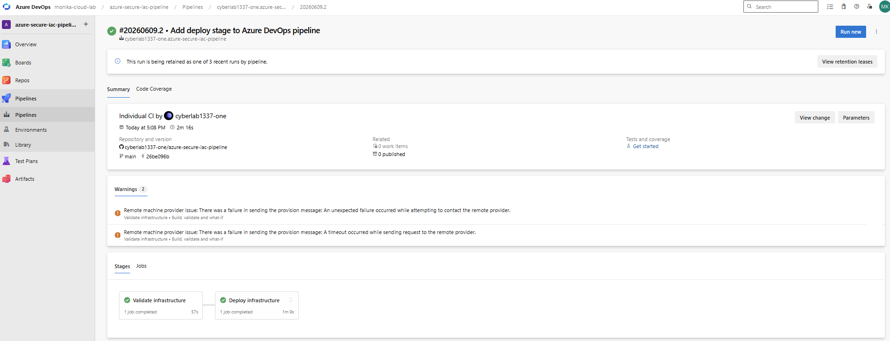
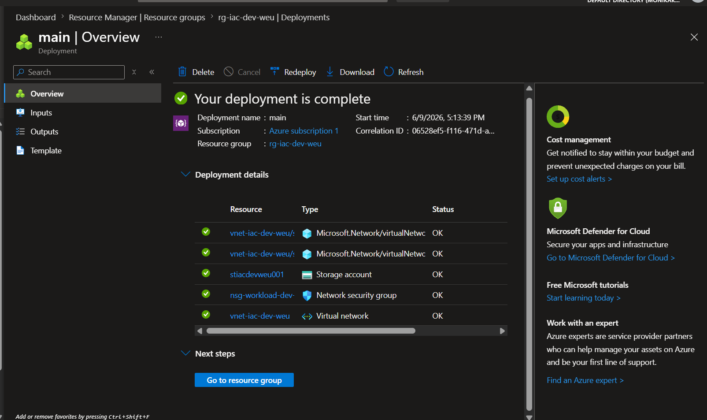

# Azure Secure IaC Pipeline

## Overview

This project demonstrates a secure Azure Infrastructure as Code (IaC) deployment pipeline built with Bicep, Azure DevOps, and GitHub.

The pipeline automatically validates, previews, and deploys Azure resources using environment-specific parameter files. The infrastructure includes a Virtual Network, Subnets, Network Security Group, and Storage Account.

## Key Skills Demonstrated
* Infrastructure as Code (IaC) with Azure Bicep
* CI/CD pipeline implementation with Azure DevOps
* Azure infrastructure validation and automated deployment
* Git and GitHub workflow for infrastructure management
* Azure CLI automation
* Environment-specific configuration management

## Architecture

- Azure Resource Group
- Virtual Network
- Subnets
- Network Security Group
- Storage Account

## Deployment Flow
```
GitHub
→ Azure DevOps
→ Validate
→ What-If
→ Deploy
→ Azure
```

## Project Structure
```
azure-secure-iac-pipeline/
├── infra/
│   ├── main.bicep
│   ├── parameters.dev.json
│   └── parameters.prod.json
├── pipelines/
│   └── azure-pipelines.yml
├── scripts/
│   └── validate.ps1
└── README.md
└── images/
    ├── azure-deployment-history.png
    └── pipeline-success.png
```

## Successful Validate & Deploy Stage



## Azure Deployment History


